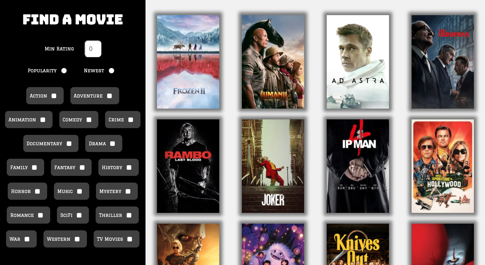
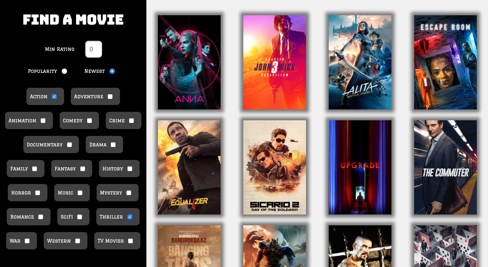
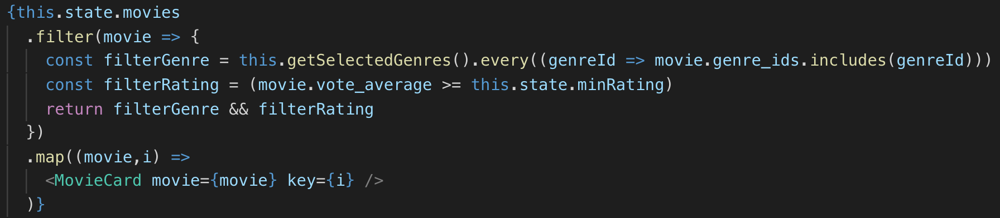
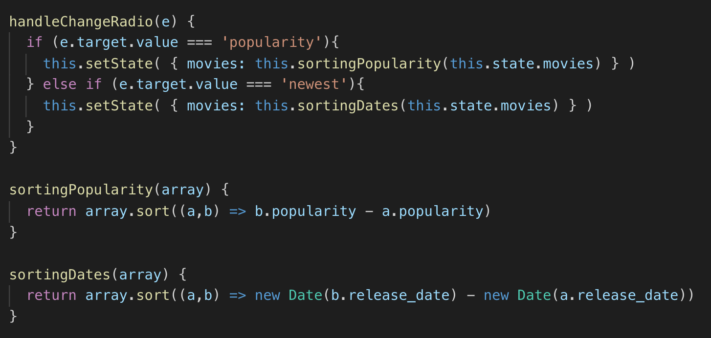

# Amazing Movies


# Intro
This project is a Movies API project, the purpose is to successfully create an application using an external API using React. This project has been executed via pair programming and is my second project whilst studying at General Assembly in the Software Engineering Immersive.

Duration: 2 days

## Motivation
As this is a pair programming project, my partner and I decided to go with a key interest of ours, movies. We use [The Movies Database](https://www.themoviedb.org/documentation/api) API heavily throughout to create an application which functions as a movie finder.


# Table of Contents
- [Deployment](##deployment)
- [Tech Used](##tech-used)
- [Getting Started](##getting-started)
- [Architecture](##architecture)
  - [Movie Index](###movie-index)
  - [Filter Sidebar](###filter-sidebar)
  - [Movie Show](###movie-show)
- [Challenges](##challenges)
- [Improvements](##improvements)
- [Developer](##developer)


## Tech used
* JavaScript
  * React
  * Axios
* HTML
* SAAS


## Deployment
The game is deployed on GitHub Pages and it can be found here: https://github.com/missreems/project-2

The application can be found here: http://amazing-movies.herokuapp.com/


## Getting Started
Use the clone button to download the source code. In the terminal enter the following commands:

```
<!-- To install all the packages: -->
$ yarn

<!-- To run in your localhost: -->
$ yarn serve
```

Check the console for any issues and if there are check the package.json for any dependancies missing


## Architecture

Amazing Movies is an application created for the purpose of simplifying the process of searching for movies to watch.

### Movie Index


The application has a Movie Index page which is also the home page. It contains lists of movies and a filter functionality on the sidebar.

### Filter Sidebar
The structure is functional and simple to keep the main attention on the main feature of the application, the filter sidebar. It is able to filter and sort the movies in various ways using checkboxes, radio buttons and a input field for numbers.





The filter function above sifts through the movies depending on the checkboxes selected and the rating chosen in the number input field. We set the function to filter only when the filtering options were selected, else all movies would display on the Movie Index page.

### Movie Show

By clicking on a movie on the Movie Index page, this links to a Movie Show page which displays information for that specific movie.


## Challenges
The main challenge of this project was creating radio buttons to sort the list of movies. Adjusting the sort array method to sort in the ways we wanted it, took a lot of time. However, using console log to see if our code was working really helped.



## Improvements
The improvements I would make is add a search bar to search a specific movie. This would allow the user to find a movie easily if they have one in mind.

Another change I would add is to add more information on the Movie Show such as actor/actress names and linking that back to the Movie Index page, which is filtered showing only movies by the specific actor/actress.


## Developer
Reema Patel
